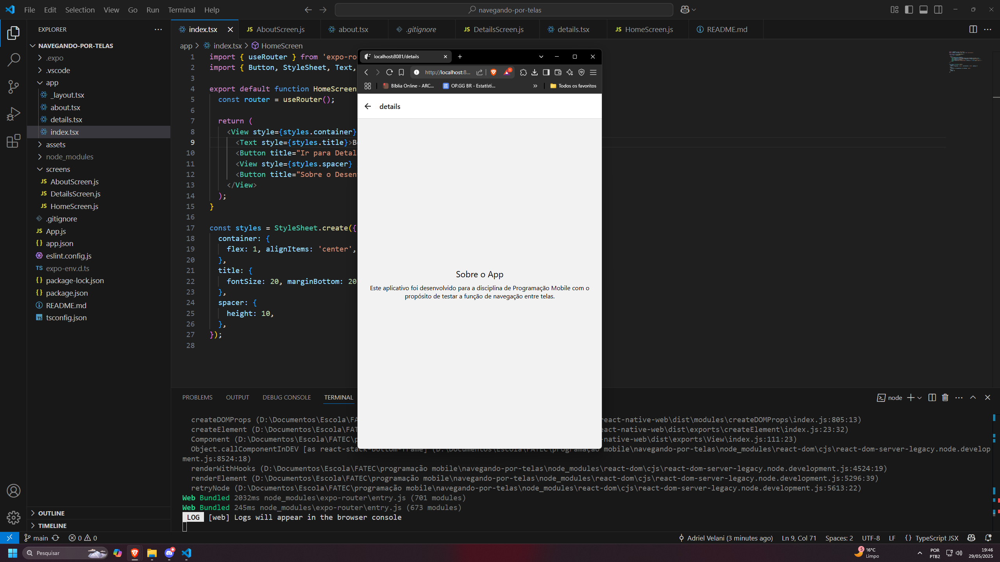

# Atividade 4 - Programação Mobile (com expo-router)

Este é um app com navegação entre telas utilizando `expo-router` com Expo.

## Estrutura das Telas

- `/` (index.tsx): Tela inicial com navegação.
- `/details`: Detalhes sobre o app.
- `/about`: Informações sobre o desenvolvedor.

## Desenvolvedor

**Adriel Velani**  
E-mail: adriel.velani@gmail.com  
GitHub: [github.com/adrielvelani](https://github.com/adrielvelani)

## Como executar

```bash
npm install
npx expo start
```

## Captura de Tela


